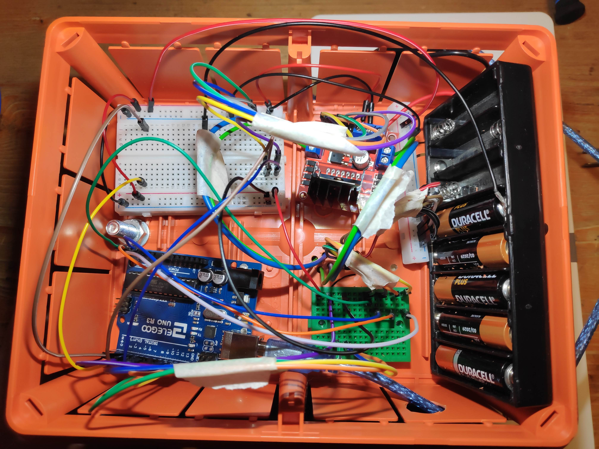
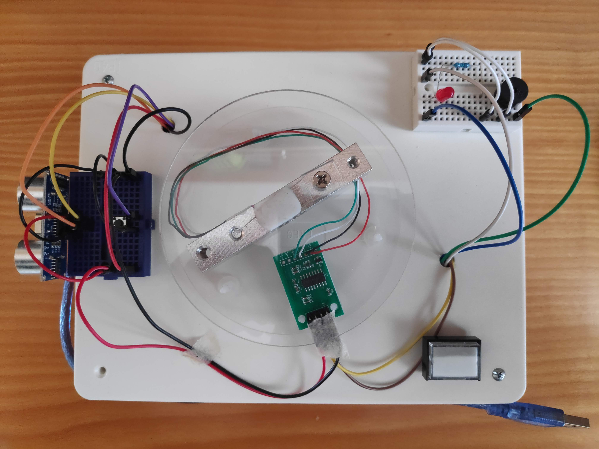
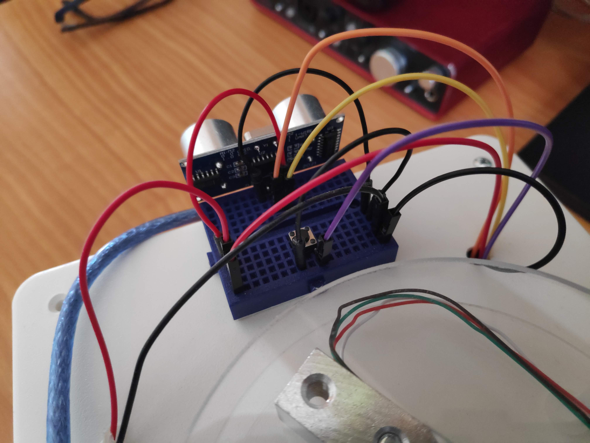
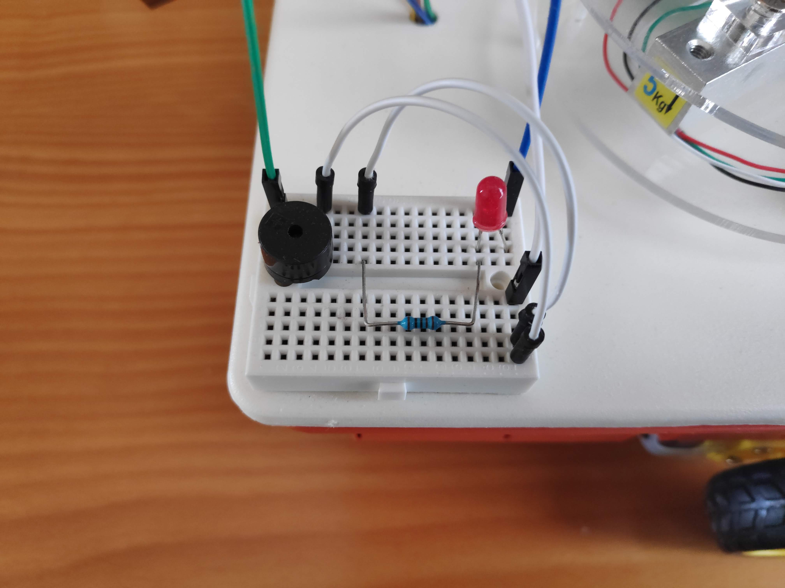
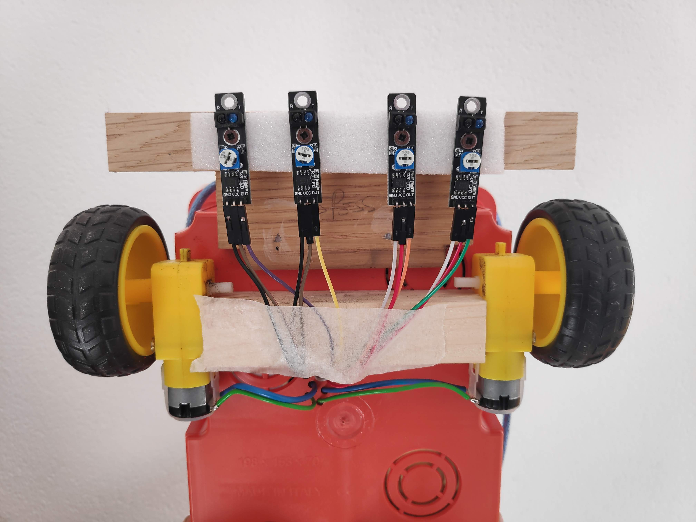
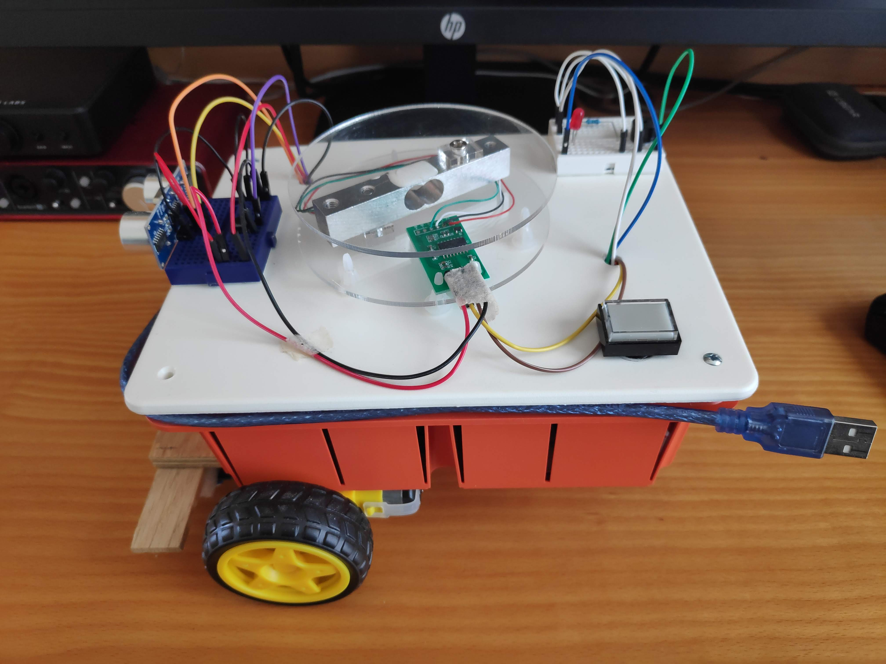
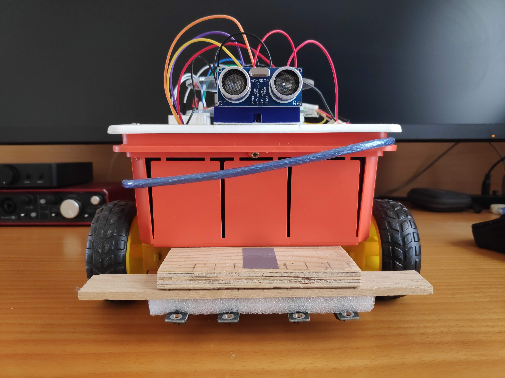

# Carrell-Ino

### Descrizione

##### Autore

Filippo Maraffio

##### Descrizione

Il progetto prevede la realizzazione di un carrello elettrico automatico, in grado di spostare piccoli oggetti, lungo un percorso prefissato.

Il "Carrell-Ino" partirà automaticamente quando rileverà la presenza di un oggetto nel suo "cassone", e si muoverà seguendo una linea marcata precedentemente sul pavimento con del nastro isolante scuro.

Raggiunta la sua destinazione, il "Carrell-Ino" si fermerà, in attesa di essere scaricato.

Una volta che il suo cassone sarà libero, il "Carrell-Ino" tornerà al punto di partenza, pronto per essere caricato nuovamente.

##### Istruzioni di utilizzo

1. Tracciare un percorso, delineato da una linea scura, su una superficie chiara (ad esempio, utilizzare del nastro isolante nero su un pavimento di legno). Alle estremità del percoso posizionare delle sagome verticali (ad esempio, delle scatole di cartone)  per delimitare inizio e fine tratto.  Posizionare il "Carrell-Ino" a cavallo della linea che traccia il tragitto, ed accenderlo.

2. Posizionare un peso di almeno 50g sulla bilancia presente sul pannello superiore del "Carrell-Ino" ed attendere. Dopo pochi istanti, il carrello emetterà un segnale acustico e luminoso ed inizierà a muoversi.

3. Il "Carrell-Ino" si muoverà seguendo il percorso prefissato e si fermerà automaticamente una volta raggiunta la sua destinazione. Una luce rossa si accenderà per richiedere l'intervento dell'utente.

4. Girare il "Carrell-Ino", in modo tale da orientarlo verso il punto di partenza e premere il pulsante di cambio stato, posizionato vicino al sensore ad ultrasuoni.

5. Il "Carrell-Ino", dapprima resterà in attesa di essere scaricato; quando non rileverà più il peso sulla bilancia, ripartirà tornando al punto di inizio, dove si fermerà. 

6. Premendo il pulsante il "Carrell-Ino" tornerà al suo stato iniziale, e, dopo averlo riposizionato, sarà possibile caricarlo e farlo ripartire per effettuare ulteriori viaggi.

##### Calibrazione bilancia

Quando si installa una nuova cella di carico sul Carrell-Ino, è opportuno effettuare una calibrazione della bilancia, così da evitare comportamenti anomali.

Per la calibrazione, procurarsi un oggetto dal peso noto, collegare il Carrell-Ino a un PC dove è installato Arduino IDE, scommentare la costante `SCALE_CALIBRATION` e impostare `LOADCELL_DIVIDER` a `1`. Caricare quindi lo sketch modificato sulla board, aprire il serial monitor e seguire le istruzioni che compariranno a schermo.

Dopo aver effettuato tutti i passaggi, dividere il numero restituito dal serial monitor per il peso dell'oggetto usato per la calibrazione e usarlo come valore della costante `LOADCELL_DIVIDER`. Ricommentare `SCALE_CALIBRATION` e caricare nuovamente lo sketch sulla board. Il Carrell-Ino è pronto a partire!

##### Hardware utilizzato

- Board: Arduino Uno

- 4x modulo di rilevamento linea KY-033 (con sensore a infrarossi TCRT5000)

- 1x sensore a ultrasuoni HC-SR04

- 1x cella di carico 0-5kg

- 1x moudlo ADC HX711 (per amplificare e convertire il segnale della cella di carico)

- 1x Motor driver L298N

- 2x motori CC da 6V

- 5x batterie AA da 1.5V  (7.5V totali)

- 1x pulsante

- 1x diodo led

- 1x resistore da 1000 Ohm

- 1x  buzzer passivo

Per la la realizzazione del telaio e del ruotino di coda sono state utilizzate una  scatola di derivazione elettrica da incasso e una rotella girevole per mobili.

##### Librerie utilizzate

- [GitHub - bogde/HX711: An Arduino library to interface the Avia Semiconductor HX711 24-Bit Analog-to-Digital Converter (ADC) for Weight Scales.](https://github.com/bogde/HX711)

---

### Progettazione

Il programma che controlla il Carrell-Ino può essere descritto, ad alto livello, tramite il seguente automa a stati finiti:

_Schema della macchina a stati finiti utilizzata per gestire le varie fasi di esecuzione._

_Schema circuitale. Immagine creata con [Fritzing](https://fritzing.org/)_

---

### Foto e video

Un video del Carrell-Ino in funzione può essere trovato al seguente link: [Carrell-Ino - YouTube](https://www.youtube.com/watch?v=kGcqHUkBG_E)

_Struttura interna del Carrell-Ino. Sono visibili la board Arduino Uno, il pacco batterie e il Motor Driver L298N._

_Pannello superiore: sulla sinistra sono presenti il sensore a ultrasuoni e il pulsante per il cambio di stato, al centro si trova la cella di carico e il rispettivo moudlo ADC HX711, mentre a destra possiamo vedere il pulsante di accensione e il blocco di output._

_Particolare del sensore a ultrasuoni e del pulsante di cambio stato._

_Particolare del blocco di output: sono osservabili il diodo led con il suo resistore e il buzzer passivo._

_Posizionamento dei moduli di rilevamento linea e dei due motori a corrente continua._

_Viste laterale e anteriore del Carrell-Ino._
