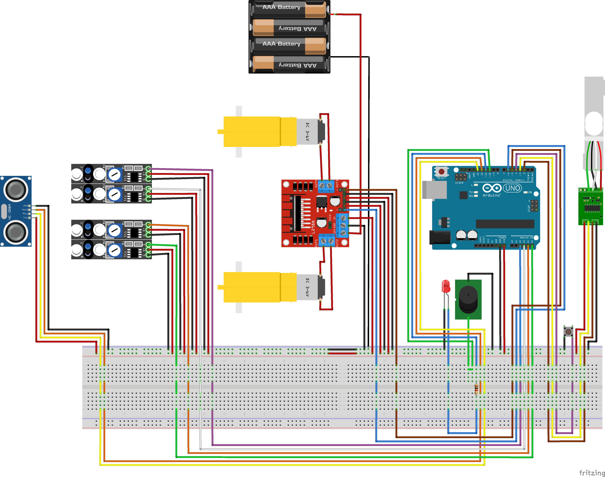

# Carrell-Ino

### Descrizione

##### Autore

Filippo Maraffio

##### Descrizione

Il progetto prevede la realizzazione di un carrello elettrico automatico, in grado di spostare piccoli oggetti lungo un percorso prefissato.

Il carrell-ino partirà automaticamente quando rileverà la presenza di un oggetto nel suo "cassone", e si muoverà seguendo una linea marcata precedentemente sul pavimento con del nastro isolante scuro.

Raggiunta la sua destinazione, il carrell-ino si fermerà, in attesa di essere scaricato.

Una volta che il suo cassone sarà libero, il carrell-ino tornerà al punto di partenza, pronto per essere caricato nuovamente.

##### Istruzioni di utizzo

1. Tracciare un percorso delineato da una linea scura su una superficie chiara (per esempio, utilizzare del nastro isolante nero su un pavimento di legno). Alle estremità del percoso posizionare delle sagome verticali (per esempio, delle scatole di cartone).

2. Posizionare il carrell-ino a cavallo della linea che delimita il percorso e accenderlo.

3. Posizionare un peso di almeno 50g sulla bilancia del carrell-ino e attendere. Dopo pochi istanti, il carrello emetterà un segnale acustico e luminoso e inizierà a muoversi.

4. Il carrell-ino si muoverà seguendo il percorso prefissato e si fermerà automaticamente una volta raggiunta la sua destinazione. Una luce rossa si accenderà per richiedere l'intervento dell'utente.

5. Girare il carrell-ino, in modo che punti verso la partenza del percorso, e premere il pulsante posizionato vicino al sensore a ultrasuoni.

6. Il carrell-ino resterà quindi in attesa di essere scaricato; quando non rileverà più il peso sulla bilancia, ripartirà, in modo analogo a come fatto nella fase 3, verso il punto di partenza, dove si fermerà.

7. Premendo il pulsante il carrell-ino tornerà al suo stato iniziale, e sarà possibile ripartire dal punto 2 per effettuare ulteriori viaggi.

##### Calibrazione bilancia

Quando si installa una nuova cella di carico sul Carrell-ino, sarebbe opportuno effettuare una calibrazione della bilancia, così da evitare comportamenti indesiderati.

Per farla, procurarsi un oggetto dal peso noto, collegare il Carrell-ino a un PC dove è installato Arduino IDE, scommentare la costante `SCALE_CALIBRATION` e impostare `LOADCELL_DIVIDER` a `1`. Caricare quindi lo sketch modificato sulla board, aprire il serial monitor e seguire le istruzioni che compariranno a schermo.

Dopo aver effettuato tutti i passaggi, dividere il numero ottenuto per il peso dell'oggetto usato per la calibrazione e usarlo per impostare `LOADCELL_DIVIDER`. Ricommentare `SCALE_CALIBRATION`, e caricare nuovamente lo sketch sulla board. Il Carrell-ino è pronto a partire!

##### Hardware utilizzato

- Board: Arduino Uno

- 4x modulo di rilevamento linea KY-033 (con sensore a infrarossi TCRT5000)

- 1x sensore a ultrasuoni HC-SR04

- 1x cella di carico 0-5kg

- 1x moudlo ADC HX711 (per amplificare e convertire il segnale della cella di carico)

- 1x Motor driver L298N

- 2x motori CC da 6V

- 5x batterie AA da 1.5V  (7.5V totali)

- 1x pulsante

- 1x diodo led

- 1x resistore da 1000 Ohm

##### Librerie utilizzate

- [GitHub - bogde/HX711: An Arduino library to interface the Avia Semiconductor HX711 24-Bit Analog-to-Digital Converter (ADC) for Weight Scales.](https://github.com/bogde/HX711)

---

### Progettazione

_Schema della macchina a stati finiti utilizzata per gestire le varie fasi di esecuzione._

_Schema circuitale. Immagine creata con [Fritzing](https://fritzing.org/)_
